# Kaggle Data Relationship Diagram (2026)

This document summarizes table relationships for:

- Raw dataset path: `data/raw/march-machine-learning-mania-2026/`
- Competition overview/rules source: `docs/march-machine-learning-mania-2026 - Overview and Data and Rules.docx`

## Key Competition Facts (from rules overview)

- Men's and women's tournaments are combined in one competition.
- Evaluation metric is Brier score.
- Submission `ID` format is `Season_LowTeamID_HighTeamID`.
- `Pred` is the probability that the lower TeamID team wins.
- Tournament round assignment is seed-pair based, not `DayNum` based.
- Team spelling normalization should use `data/TeamSpellings.csv` as canonical.

## Entity Relationship Diagram

```mermaid
erDiagram
    MSEASONS ||--o{ MREGULARSEASONCOMPACTRESULTS : "Season"
    MSEASONS ||--o{ MREGULARSEASONDETAILEDRESULTS : "Season"
    MSEASONS ||--o{ MNCAATOURNEYCOMPACTRESULTS : "Season"
    MSEASONS ||--o{ MNCAATOURNEYDETAILEDRESULTS : "Season"
    MSEASONS ||--o{ MNCAATOURNEYSEEDS : "Season"
    MSEASONS ||--o{ MNCAATOURNEYSLOTS : "Season"
    MSEASONS ||--o{ TOURNEYROUNDLOOKUP : "via seed-pair mapping logic"
    MSEASONS ||--o{ MTEAMCONFERENCES : "Season"
    MSEASONS ||--o{ MCONFERENCETOURNEYGAMES : "Season"
    MSEASONS ||--o{ MSECONDARYTOURNEYCOMPACTRESULTS : "Season"
    MSEASONS ||--o{ MSECONDARYTOURNEYTEAMS : "Season"
    MSEASONS ||--o{ MTEAMCOACHES : "Season"
    MSEASONS ||--o{ MMASSEYORDINALS : "Season"
    MSEASONS ||--o{ MGAMECITIES : "Season"

    WSEASONS ||--o{ WREGULARSEASONCOMPACTRESULTS : "Season"
    WSEASONS ||--o{ WREGULARSEASONDETAILEDRESULTS : "Season"
    WSEASONS ||--o{ WNCAATOURNEYCOMPACTRESULTS : "Season"
    WSEASONS ||--o{ WNCAATOURNEYDETAILEDRESULTS : "Season"
    WSEASONS ||--o{ WNCAATOURNEYSEEDS : "Season"
    WSEASONS ||--o{ WNCAATOURNEYSLOTS : "Season"
    WSEASONS ||--o{ TOURNEYROUNDLOOKUP : "via seed-pair mapping logic"
    WSEASONS ||--o{ WTEAMCONFERENCES : "Season"
    WSEASONS ||--o{ WCONFERENCETOURNEYGAMES : "Season"
    WSEASONS ||--o{ WSECONDARYTOURNEYCOMPACTRESULTS : "Season"
    WSEASONS ||--o{ WSECONDARYTOURNEYTEAMS : "Season"
    WSEASONS ||--o{ WGAMECITIES : "Season"

    MTEAMS ||--o{ MTEAMCONFERENCES : "TeamID"
    MTEAMS ||--o{ MTEAMCOACHES : "TeamID"
    MTEAMS ||--o{ MMASSEYORDINALS : "TeamID"
    MTEAMS ||--o{ MTEAMSPELLINGS : "TeamID"
    MTEAMS ||--o{ MNCAATOURNEYSEEDS : "TeamID"
    MTEAMS ||--o{ MSECONDARYTOURNEYTEAMS : "TeamID"
    MTEAMS ||--o{ MREGULARSEASONCOMPACTRESULTS : "WTeamID/LTeamID"
    MTEAMS ||--o{ MREGULARSEASONDETAILEDRESULTS : "WTeamID/LTeamID"
    MTEAMS ||--o{ MNCAATOURNEYCOMPACTRESULTS : "WTeamID/LTeamID"
    MTEAMS ||--o{ MNCAATOURNEYDETAILEDRESULTS : "WTeamID/LTeamID"
    MTEAMS ||--o{ MSECONDARYTOURNEYCOMPACTRESULTS : "WTeamID/LTeamID"
    MTEAMS ||--o{ MCONFERENCETOURNEYGAMES : "WTeamID/LTeamID"
    MTEAMS ||--o{ MGAMECITIES : "WTeamID/LTeamID"

    WTEAMS ||--o{ WTEAMCONFERENCES : "TeamID"
    WTEAMS ||--o{ WTEAMSPELLINGS : "TeamID"
    WTEAMS ||--o{ WNCAATOURNEYSEEDS : "TeamID"
    WTEAMS ||--o{ WSECONDARYTOURNEYTEAMS : "TeamID"
    WTEAMS ||--o{ WREGULARSEASONCOMPACTRESULTS : "WTeamID/LTeamID"
    WTEAMS ||--o{ WREGULARSEASONDETAILEDRESULTS : "WTeamID/LTeamID"
    WTEAMS ||--o{ WNCAATOURNEYCOMPACTRESULTS : "WTeamID/LTeamID"
    WTEAMS ||--o{ WNCAATOURNEYDETAILEDRESULTS : "WTeamID/LTeamID"
    WTEAMS ||--o{ WSECONDARYTOURNEYCOMPACTRESULTS : "WTeamID/LTeamID"
    WTEAMS ||--o{ WCONFERENCETOURNEYGAMES : "WTeamID/LTeamID"
    WTEAMS ||--o{ WGAMECITIES : "WTeamID/LTeamID"

    CONFERENCES ||--o{ MTEAMCONFERENCES : "ConfAbbrev"
    CONFERENCES ||--o{ WTEAMCONFERENCES : "ConfAbbrev"
    CONFERENCES ||--o{ MCONFERENCETOURNEYGAMES : "ConfAbbrev"
    CONFERENCES ||--o{ WCONFERENCETOURNEYGAMES : "ConfAbbrev"

    CITIES ||--o{ MGAMECITIES : "CityID"
    CITIES ||--o{ WGAMECITIES : "CityID"

    MREGULARSEASONCOMPACTRESULTS ||--o| MREGULARSEASONDETAILEDRESULTS : "Season-DayNum-WTeamID-LTeamID (subset)"
    MNCAATOURNEYCOMPACTRESULTS ||--o| MNCAATOURNEYDETAILEDRESULTS : "Season-DayNum-WTeamID-LTeamID (subset)"
    WREGULARSEASONCOMPACTRESULTS ||--o| WREGULARSEASONDETAILEDRESULTS : "Season-DayNum-WTeamID-LTeamID (subset)"
    WNCAATOURNEYCOMPACTRESULTS ||--o| WNCAATOURNEYDETAILEDRESULTS : "Season-DayNum-WTeamID-LTeamID (subset)"
    MNCAATOURNEYSEEDS ||--o{ TOURNEYROUNDLOOKUP : "StrongSeed/WeakSeed after seed normalization"
    WNCAATOURNEYSEEDS ||--o{ TOURNEYROUNDLOOKUP : "StrongSeed/WeakSeed after seed normalization"
```

## Practical Join Keys

- Game identity (most game-level joins):
  - `Season, DayNum, WTeamID, LTeamID`
- Team-season joins:
  - `Season, TeamID`
- Team spelling joins:
  - `TeamNameSpelling` via `data/TeamSpellings.csv` (master mapping)
- Conference joins:
  - `ConfAbbrev`
- City joins:
  - `CityID`

## Notes

- Men's TeamIDs and women's TeamIDs do not overlap.
- `W*` / `L*` columns in result files mean winning/losing team, not women/men.
- Detailed results are a subset of compact results by season coverage (not every compact row has a detailed row).
- Canonical round assignment is derived from normalized seed pairings using `data/tourney_round_lookup.csv`.
- Play-in detection rule: if normalized seeds are identical (`W16a` vs `W16b` -> `W16`), assign `Round = 0`.
- Do not identify NCAA tournament round using `DayNum`.
- Prefer `data/TeamSpellings.csv` over Kaggle `MTeamSpellings.csv`/`WTeamSpellings.csv` in project pipelines.
- For predictive modeling, normalize game rows into team-vs-team orientation before feature creation.
